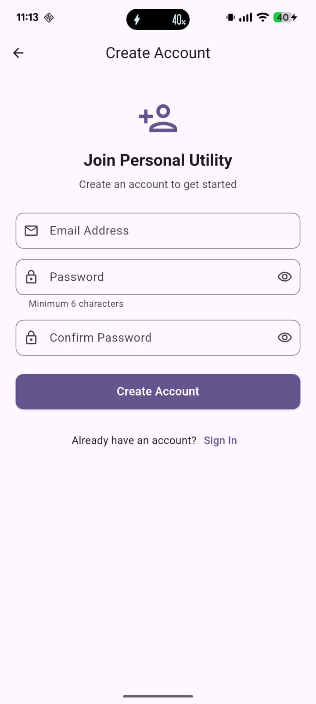
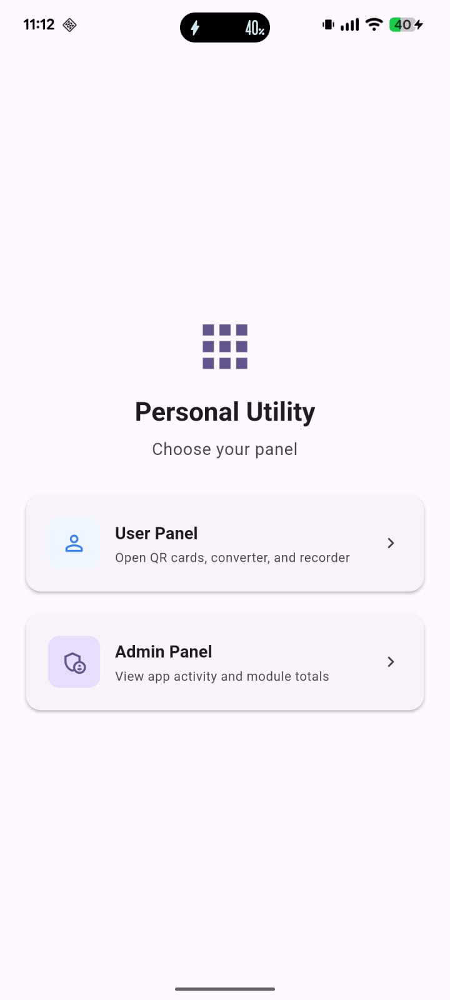
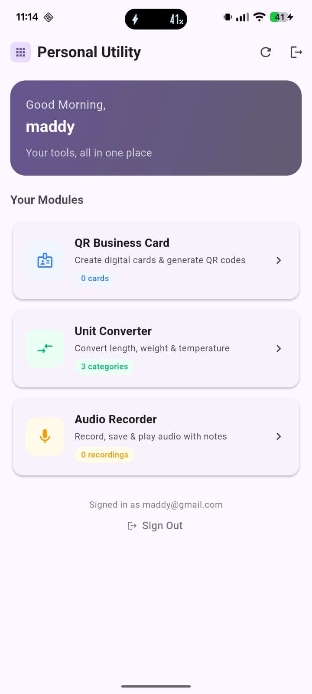
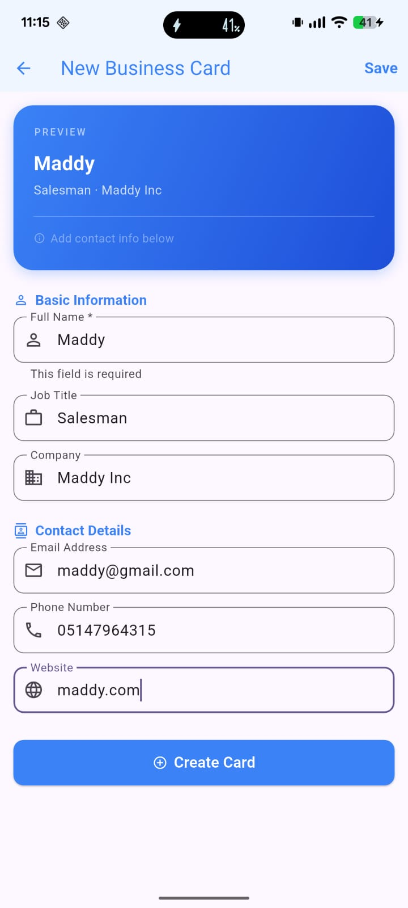
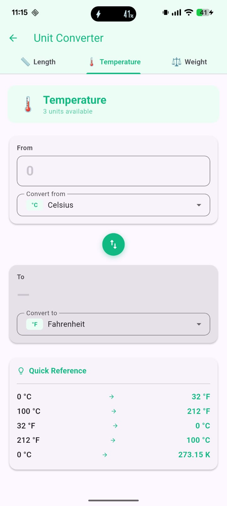
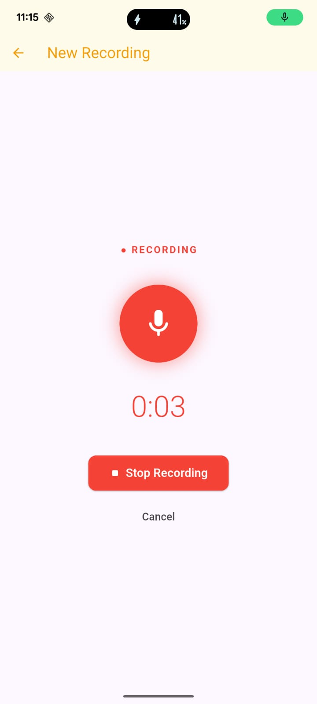
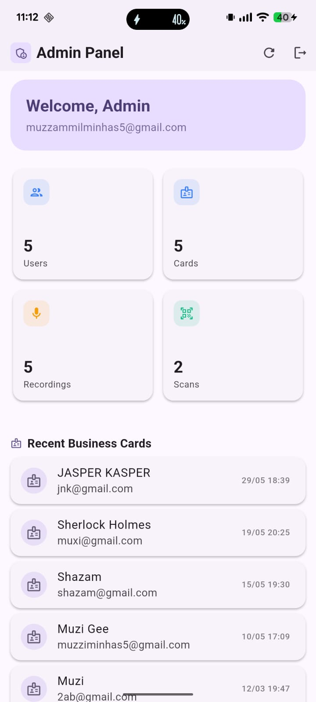
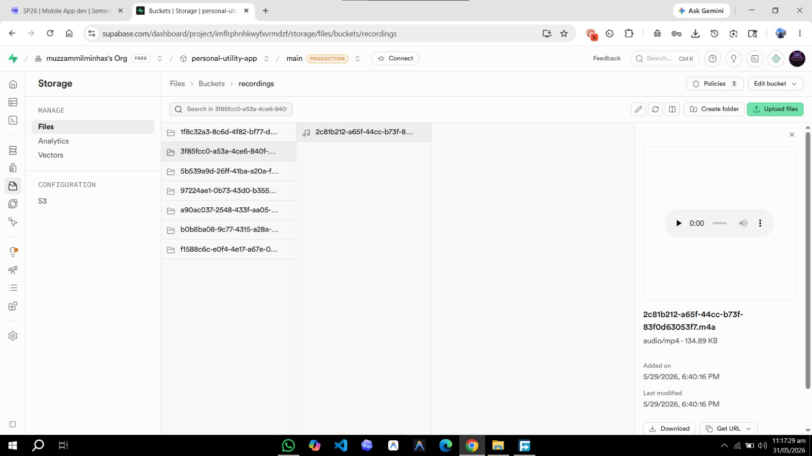
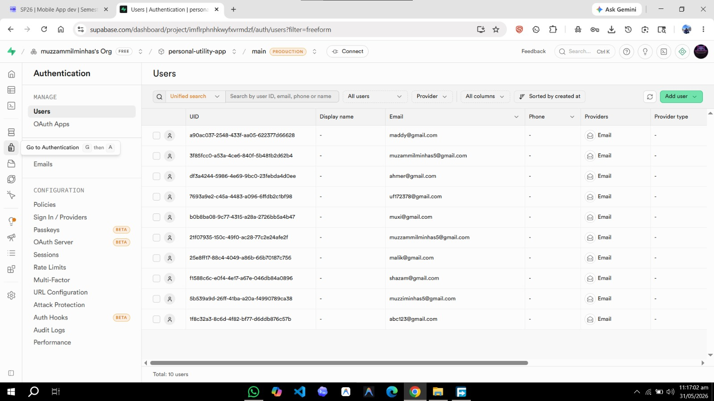
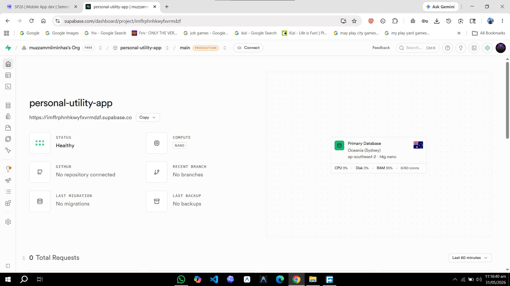

# Personal Utility App

Personal Utility App is a Flutter application that combines common productivity tools behind Supabase authentication. It includes QR business card management, QR scan history, a unit converter, audio note recording/playback, and an admin dashboard backed by Supabase Auth, Postgres, Storage, and Row Level Security.

This project was built as a 5th-semester Mobile Application Development project.

## Features

- Email/password authentication with Supabase Auth
- User and admin panel routing after login
- Database-driven admin access through `public.app_admins`
- Password reset flow with the Android deep link `personalutilityapp://auth/reset-password`
- QR business card create, read, update, and delete flow
- QR code generation from saved business card data
- QR scanner with saved scan history
- Local unit converter for common measurement categories
- Audio note recording with title and notes
- Private audio upload to Supabase Storage
- Recording list, playback, edit, and delete screens
- Admin dashboard for totals and recent activity across cards, scans, and recordings
- Provider-based state management
- Flutter launcher icon configuration for mobile, web, Windows, and macOS

## Tech Stack

- Flutter 3.41.9
- Dart 3.11.5
- Provider
- Supabase Auth
- Supabase Postgres
- Supabase Storage
- Supabase Row Level Security
- `supabase_flutter`
- `qr_flutter`
- `mobile_scanner`
- `record`
- `audioplayers`
- `path_provider`
- `uuid`
- `intl`
- `google_fonts`
- `flutter_launcher_icons`

## Folder Structure

```text
personal_utility_app/
  android/                         Android project and permissions
  assets/
    icon/app_icon.png              App launcher icon source
  ios/                             iOS project files
  lib/
    config/admin_config.dart       Admin table and role-source constants
    main.dart                      Supabase initialization, providers, root routing
    models/                        App data models
    providers/                     Auth, QR card, and recording state
    screens/
      admin/                       Admin dashboard
      auth/                        Login, signup, panel selection, reset password
      converter/                   Unit converter screen
      home/                        User home panel
      qr_card/                     QR card CRUD, QR display, scanner, history
      recorder/                    Audio record, list, playback, edit
    services/                      Supabase database and audio storage services
    utils/                         App constants
    widgets/                       Shared UI widgets
  linux/                           Linux desktop project files
  macos/                           macOS desktop project files
  screenshots/                     README screenshots extracted from project submission
  test/                            Flutter widget test folder
  web/                             Web project files
  windows/                         Windows desktop project files
  supabase_setup.sql               Database, Storage, and RLS setup script
  pubspec.yaml                     Dependencies and asset configuration
```

`Project submission/` is a local submission/export folder and is ignored by Git. The screenshots needed for this README were copied into `screenshots/`.

## Installation

Run all commands in PowerShell.

```powershell
cd C:\FlutterProjects\personal_utility_app
flutter --version
flutter pub get
```

If you are cloning the repository onto another machine:

```powershell
git clone https://github.com/muzzammilminhas/personal_utility_app.git
cd personal_utility_app
flutter pub get
```

## Supabase Setup

Create a Supabase project, then run the setup script from this repository.

```powershell
Get-Content .\supabase_setup.sql | Set-Clipboard
```

Then open the Supabase SQL Editor, paste the copied SQL, and run it.

The script creates:

- `business_cards`
- `scan_history`
- `recordings`
- `app_admins`
- private Storage bucket `recordings`
- helper function `public.is_app_admin()`
- RLS policies for normal user data access
- RLS policies for admin dashboard reads

The app currently initializes Supabase with this project's configured URL and public anon key in:

```text
lib/main.dart
```

If this app is moved to a different Supabase project, replace the `supabaseUrl` and `supabaseAnonKey` constants in that file with values from Supabase Dashboard -> Project Settings -> API.

The anon key is a client-side public key, but never commit a Supabase service-role key, database password, JWT secret, or private API token.

## Password Reset Deep Link

Add this redirect URL in Supabase:

```text
Authentication -> URL Configuration -> Additional Redirect URLs
personalutilityapp://auth/reset-password
```

Android handles the redirect in:

```text
android/app/src/main/AndroidManifest.xml
```

The matching intent filter uses:

```xml
<data
    android:scheme="personalutilityapp"
    android:host="auth"
    android:pathPrefix="/reset-password" />
```

## Run Commands

Run the app on the default connected device:

```powershell
flutter run
```

Run on Chrome:

```powershell
flutter run -d chrome
```

Run static analysis:

```powershell
flutter analyze
```

Run tests:

```powershell
flutter test
```

Build a debug APK:

```powershell
flutter build apk --debug
```

Build a release APK:

```powershell
flutter build apk --release
```

Build for web:

```powershell
flutter build web --release
```

Regenerate launcher icons after changing `assets/icon/app_icon.png`:

```powershell
dart run flutter_launcher_icons
```

## Screenshots

### App Screens

| Signup | Home | User Panel |
| --- | --- | --- |
|  |  |  |

| QR Card | Unit Converter | Audio Notes |
| --- | --- | --- |
|  |  |  |

| Admin Panel |
| --- |
|  |

### Supabase Screens

| Supabase Home | Authentication |
| --- | --- |
|  |  |

| Storage Bucket |
| --- |
|  |

## Important Files

- `lib/main.dart` initializes Supabase, registers providers, and controls root routing.
- `lib/providers/auth_provider.dart` contains authentication, password recovery, and admin role logic.
- `lib/services/database_service.dart` contains Supabase table operations.
- `lib/services/audio_service.dart` handles audio file upload, signed URLs, and deletion.
- `lib/providers/business_card_provider.dart` manages QR card and scan history state.
- `lib/providers/recording_provider.dart` manages recording state.
- `lib/screens/admin/admin_dashboard_screen.dart` renders admin totals and recent records.
- `supabase_setup.sql` is the database, Storage, helper function, and RLS source of truth.

## Do Not Push

Do not commit these files or folders:

- `.env`, `.env.*`, and `$PROFILE.env`
- Supabase service-role keys, database passwords, JWT secrets, or private API tokens
- Android signing files such as `*.jks`, `*.keystore`, `key.properties`, or `local.properties`
- Generated Flutter folders such as `build/`, `.dart_tool/`, `.pub/`, and `coverage/`
- Local IDE/cache folders such as `.idea/`, `.vscode/`, and `.gradle/`
- Local submission/export bundles such as `Project submission/`
- ZIP/RAR/7z archives created for assignment submission

The `docs/` directory in this checkout contains generated Flutter web build output. Keep it only if you intentionally use it for GitHub Pages; otherwise treat it as generated build output.

## Author

Muzammil Minhas

- GitHub: [@muzzammilminhas](https://github.com/muzzammilminhas)

## License

This project is intended for academic and personal utility app development. Add a formal license before public distribution.
